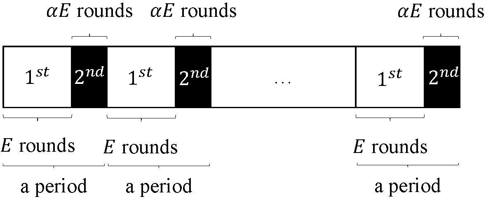
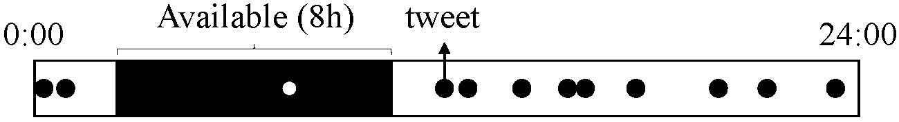

# Federated-Latest-Averaging
Implementation of https://www.semanticscholar.org/paper/Distributed-Non-Convex-Optimization-with-Sublinear-Yan-Niu/ff078486ea4b0a0fa8626a98055526c144eb38c0 

## Dependency
+ beautifulsoup4 (4.9.1)
+ bs4 (0.0.1)
+ gensim (3.8.3)
+ lxml (4.5.2)
+ matplotlib (3.2.1)
+ nltk (3.5)
+ numpy (1.18.2)
+ Pillow (7.1.1)
+ tensorboard (2.2.2)
+ torch (1.4.0)
+ torchvision (0.5.0)

## Usage
Please run experiments via train/server.py. Enter "cd train && python server.py -h" to see the help. Running parameters are discribed as follows (running argument may have changed, please refer to the output of "python server.py -h" when running the code).

### Optional arguments
+ -h, --help
  + show this help message and exit
+ -rn RUN_NAME, --run_name RUN_NAME
  + run name to be specified.If not give, generated according to parameters.
+ -ds {cifar10,sentiment140}, --dataset {cifar10,sentiment140}:
  + dataset to use
+ -alg {gd,sgd,lastavg,fedavg}, --algorithm {gd,sgd,lastavg,fedavg}
  + algorithm to be used
+ -N NUM_TOTAL_CLIENTS, --num_total_clients NUM_TOTAL_CLIENTS
  + total number of clients
+ -be BETA, --beta BETA
  + proportion of selected clients
+ -C NUM_LOCAL_ITERATIONS, --num_local_iterations NUM_LOCAL_ITERATIONS
  + number of iterations per round
+ -E E
  + controlling availability, defined in paper
+ --alpha ALPHA
  + controlling availability, defined in paper
+ --momentum MOMENTUM 
  + momentum for fedavg (not for sgd gd)
+ --batch_size BATCH_SIZE
  + batch size for each client
+ --batch_size_when_test BATCH_SIZE_WHEN_TEST
  + batch size when testing the model
+ --num_rounds NUM_ROUNDS
  + number of rounds
+ --num_hours1block NUM_HOURS1BLOCK
  + number of hours one block
+ --num_non_update_rounds NUM_NON_UPDATE_ROUNDS
  + for FedLaAvg, do not update in the first <?> rounds, only collect gradients

### Learning rate arguments
+ --lr_strategy {const,exp,multi}
  + learning rate strategy
+ -lr INIT_LR, --init_lr INIT_LR
  + initial learning rate
+ --lr_decay LR_DECAY
  + learning rate decay for exp
+ --lr_indicator LR_INDICATOR
  + for multistep decay, specify to make each run distinct
+ --lr_config LR_CONFIG
  + learning rate configuration file to be loaded for multistep

### Printing control arguments
+ -pe PRINT_EVERY, --print_every PRINT_EVERY
  + control printings without computation
+ -te TB_EVERY, --tb_every TB_EVERY
  + control printings with computation
+ -ce CHECKPOINT_EVERY, --checkpoint_every CHECKPOINT_EVERY
  + control checkpoint interval
+ -se STATISTICS_EVERY, --statistics_every STATISTICS_EVERY
  + control statistics interval
+ --max_test MAX_TEST   
  + maximum number of samples to be tested when logging

### Machine learning model arguments
+ --model_ori MODEL_ORI
  + model id specified for the give algorithm
+ --nlp_algorithm {bow,embedding}
  + NLP algorithm
+ --glove_model GLOVE_MODEL
  + glove model file name without extension

### Sentiment140 customized arguments
+ --filter_clients FILTER_CLIENTS
  + filter clients possessing data <= this threshold, work only for sentiment140 (include SGD and GD)
 
## Algorithm illustration and some experiment setups
### Algorithm overview 
<p align="center">
  
</p>

### Availability setting for MNIST
<p align="center">
  
</p>

### Availability setting for Sentiment140
<p align="center">
  
</p>

## Citation
```
@article{DBLP:journals/corr/abs-2002-07399,
  author    = {Yikai Yan and
               Chaoyue Niu and
               Yucheng Ding and
               Zhenzhe Zheng and
               Fan Wu and
               Guihai Chen and
               Shaojie Tang and
               Zhihua Wu},
  title     = {Distributed Non-Convex Optimization with Sublinear Speedup under Intermittent
               Client Availability},
  journal   = {CoRR},
  volume    = {abs/2002.07399},
  year      = {2020}
}
```
