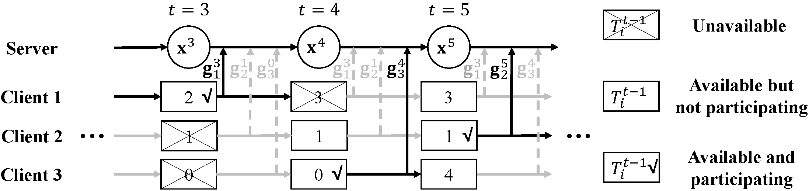

# Federated-Latest-Averaging
Implementation of https://arxiv.org/abs/2002.07399

## Dependency
+ beautifulsoup4 (4.9.1)
+ bs4 (0.0.1)
+ gensim (3.8.3)
+ lxml (4.5.2)
+ matplotlib (3.2.1)
+ nltk (3.5)
+ numpy (1.18.2)
+ Pillow (7.1.1)
+ tensorboard (2.2.2)
+ torch (1.4.0)
+ torchvision (0.5.0)

## Usage
Please run experiments via train/server.py. 
Enter "python train/server.py -h" to see the help. 

### Instructions to Reproduce the Results
```shell script
#d
```
 
## Algorithm illustration


## Citation
```
@article{DBLP:journals/corr/abs-2002-07399,
  author    = {Yikai Yan and
               Chaoyue Niu and
               Yucheng Ding and
               Zhenzhe Zheng and
               Fan Wu and
               Guihai Chen and
               Shaojie Tang and
               Zhihua Wu},
  title     = {Distributed Non-Convex Optimization with Sublinear Speedup under Intermittent
               Client Availability},
  journal   = {CoRR},
  volume    = {abs/2002.07399},
  year      = {2020}
}
```
